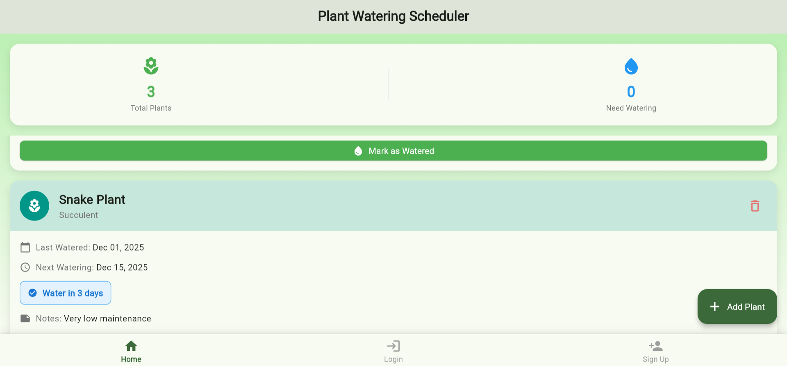
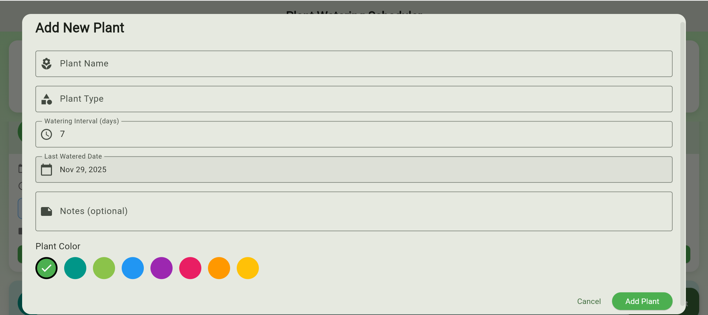

## 🌱 Plant Watering Schedule Manager

A simple and intuitive Flutter app to help users manage and track watering schedules for their plants.

# 📌 Overview

The Plant Watering Schedule Manager is a lightweight mobile application designed to remind users when each plant needs watering. It allows users to add plants, assign watering intervals, and keep track of the next watering date — all within a clean, single-page UI.
No backend or external database is used.

# ✨ Features

➕ Add a plant with its name & watering frequency

🗓️ Automatically calculates the next watering date

🔔 Visual reminders inside the app

📋 Simple list view of all plants

🧹 Delete plants easily

🎨 Clean Flutter UI using modern components

# 📱 Screenshots

# 🛠️ Tech Stack

Flutter (Dart)

Single-page architecture

No backend or database yet

# ▶️ Getting Started
1. Clone the repo
git clone https://github.com/elghazzirania-cloud/Plant-Watering-Scheduler-App.git
cd plant-watering-scheduler

2. Install dependencies
flutter pub get

3. Run the app
flutter run

# 📌 Future Improvements

 Adding these later:

📦 Local database 

🔔 Push notifications

📷 Add plant images
